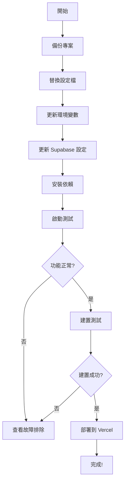

# 🎉 Next.js 遷移完成！

你的專案已準備好從 Vite 遷移到 Next.js 15。所有必要的檔案和文件都已建立。

---

## 📦 已建立的檔案

### 🔧 核心設定檔案

1. **[next.config.js](next.config.js)** - Next.js 主要設定
2. **[tsconfig.next.json](tsconfig.next.json)** - TypeScript 設定
3. **[package.next.json](package.next.json)** - 依賴套件清單
4. **[.env.local.example](.env.local.example)** - 環境變數範例

### 📁 App 目錄檔案

5. **[app/layout.tsx](app/layout.tsx)** - Root Layout（全域配置）
6. **[app/page.tsx](app/page.tsx)** - 首頁（對應原 App.tsx）
7. **[app/providers.tsx](app/providers.tsx)** - Context Providers

### 🔌 Supabase 整合

8. **[src/lib/supabase.client.ts](src/lib/supabase.client.ts)** - 客戶端 Supabase
9. **[src/lib/supabase.server.ts](src/lib/supabase.server.ts)** - 伺服器端 Supabase
10. **[src/contexts/SchoolContext.nextjs.tsx](src/contexts/SchoolContext.nextjs.tsx)** - 更新的 Context

### 📚 文件檔案

11. **[NEXTJS_MIGRATION_GUIDE.md](NEXTJS_MIGRATION_GUIDE.md)** - 完整遷移指南（15 分鐘）
12. **[NEXTJS_QUICK_START.md](NEXTJS_QUICK_START.md)** - 快速開始（10 分鐘）
13. **[NEXTJS_CHECKLIST.md](NEXTJS_CHECKLIST.md)** - 詳細檢查清單
14. **[NEXTJS_README.md](NEXTJS_README.md)** - 本檔案（總覽）

---

## 🚀 開始遷移

### 選項 A：快速開始（推薦新手）

1. 閱讀 **[NEXTJS_QUICK_START.md](NEXTJS_QUICK_START.md)**（10 分鐘）
2. 跟著步驟執行
3. 啟動測試

### 選項 B：詳細指南（推薦深入理解）

1. 閱讀 **[NEXTJS_MIGRATION_GUIDE.md](NEXTJS_MIGRATION_GUIDE.md)**（15 分鐘）
2. 了解每個變更的原因
3. 按步驟遷移

### 選項 C：使用檢查清單（推薦團隊協作）

1. 開啟 **[NEXTJS_CHECKLIST.md](NEXTJS_CHECKLIST.md)**
2. 逐項完成檢查
3. 確保無遺漏

---

## ⚡ 最快速開始（3 分鐘）

如果你只想最快速度啟動，執行以下指令：

```bash
# 1. 替換設定檔
mv package.json package.vite.backup.json && mv package.next.json package.json
mv tsconfig.json tsconfig.vite.backup.json && mv tsconfig.next.json tsconfig.json

# 2. 更新 Context
mv src/contexts/SchoolContext.tsx src/contexts/SchoolContext.vite.backup.tsx
mv src/contexts/SchoolContext.nextjs.tsx src/contexts/SchoolContext.tsx

# 3. 更新環境變數（手動編輯 .env，將 VITE_ 改為 NEXT_PUBLIC_）
cp .env .env.local

# 4. 安裝依賴
npm install

# 5. 啟動
npm run dev
```

訪問 http://localhost:3000

---

## 📊 主要變更概覽

| 項目 | Vite | Next.js |
|------|------|---------|
| **框架** | Vite + React | Next.js 15 |
| **路由** | React Router | File-based Routing |
| **環境變數** | `VITE_*` | `NEXT_PUBLIC_*` |
| **入口點** | `src/main.tsx` | `app/layout.tsx` |
| **主元件** | `src/App.tsx` | `app/page.tsx` |
| **建置指令** | `npm run build` | `npm run build` |
| **開發指令** | `npm run dev` | `npm run dev` |
| **Dev Server** | http://localhost:5173 | http://localhost:3000 |

---

## ✨ 新功能

遷移到 Next.js 後，你將獲得：

### 1. 更好的 SEO
- Server-Side Rendering（SSR）
- 動態 meta tags
- 自動 sitemap 生成

### 2. 更快的效能
- 自動程式碼分割
- Image 優化
- 字型優化
- 靜態生成（ISR）

### 3. 內建功能
- API Routes（無需額外後端）
- Middleware（請求處理）
- Image Component（自動優化）
- Font Optimization（字型優化）

### 4. 更簡單的部署
- Vercel 一鍵部署
- 自動 CI/CD
- Preview 環境
- 全球 CDN

---

## 📁 檔案結構對照

### Before (Vite)
```
src/
├── main.tsx          # 入口點
├── App.tsx           # 主元件
├── components/
├── contexts/
├── hooks/
└── utils/
```

### After (Next.js)
```
app/
├── layout.tsx        # 全域配置
├── page.tsx          # 首頁
└── providers.tsx     # Providers

src/
├── components/       # 保持不變
├── contexts/         # 保持不變（需更新匯入）
├── hooks/            # 保持不變
├── lib/              # 新增 Supabase clients
├── styles/           # 新增全域樣式
└── utils/            # 保持不變
```

---

## 🔑 環境變數更新

**重要！** 必須更新環境變數名稱：

```bash
# Before (Vite)
VITE_MAPBOX_TOKEN=...
VITE_SUPABASE_URL=...
VITE_SUPABASE_ANON_KEY=...
```

```bash
# After (Next.js)
NEXT_PUBLIC_MAPBOX_TOKEN=...
NEXT_PUBLIC_SUPABASE_URL=...
NEXT_PUBLIC_SUPABASE_ANON_KEY=...
```

**為什麼？**
- Next.js 使用 `NEXT_PUBLIC_` 前綴來暴露環境變數給客戶端
- 這是安全性最佳實踐，避免意外暴露伺服器端變數

---

## 🎯 遷移步驟概覽



---

## 🐛 常見問題

### Q1: 為什麼要遷移到 Next.js？
**A:** 更好的 SEO、更快的載入速度、更簡單的部署、更強大的功能。

### Q2: 遷移會很複雜嗎？
**A:** 不會！我們已經準備好所有檔案和詳細指南，只需 10-15 分鐘。

### Q3: 現有的元件需要重寫嗎？
**A:** 不需要！所有 React 元件都可以直接使用，無需修改。

### Q4: Supabase 需要重新設定嗎？
**A:** 不需要！只需更新環境變數和匯入路徑即可。

### Q5: 部署會更困難嗎？
**A:** 相反！Next.js 部署到 Vercel 只需要幾分鐘，而且完全免費。

---

## 📚 推薦閱讀順序

### 對於新手
1. **[NEXTJS_QUICK_START.md](NEXTJS_QUICK_START.md)** ⭐ 從這裡開始
2. **[NEXTJS_CHECKLIST.md](NEXTJS_CHECKLIST.md)** - 確保無遺漏
3. **[NEXTJS_MIGRATION_GUIDE.md](NEXTJS_MIGRATION_GUIDE.md)** - 深入理解

### 對於有經驗的開發者
1. **[NEXTJS_MIGRATION_GUIDE.md](NEXTJS_MIGRATION_GUIDE.md)** - 技術細節
2. **[NEXTJS_CHECKLIST.md](NEXTJS_CHECKLIST.md)** - 快速檢查
3. **[Next.js 官方文件](https://nextjs.org/docs)** - 進階功能

### 對於團隊協作
1. **[NEXTJS_CHECKLIST.md](NEXTJS_CHECKLIST.md)** - 分工明確
2. **[NEXTJS_MIGRATION_GUIDE.md](NEXTJS_MIGRATION_GUIDE.md)** - 技術參考
3. 團隊會議討論遷移計畫

---

## 🎓 學習資源

### 官方文件
- [Next.js 官方文件](https://nextjs.org/docs)
- [Next.js 15 發布說明](https://nextjs.org/blog/next-15)
- [App Router 遷移](https://nextjs.org/docs/app/building-your-application/upgrading/app-router-migration)

### 影片教學
- [Next.js in 100 Seconds](https://www.youtube.com/watch?v=Sklc_fQBmcs)
- [Next.js App Router Course](https://nextjs.org/learn)

### 社群資源
- [Next.js Discord](https://discord.gg/nextjs)
- [Next.js GitHub](https://github.com/vercel/next.js)
- [Stack Overflow](https://stackoverflow.com/questions/tagged/next.js)

---

## 🆘 需要幫助？

### 故障排除
1. 查看 [NEXTJS_MIGRATION_GUIDE.md](NEXTJS_MIGRATION_GUIDE.md) 的故障排除章節
2. 檢查 [NEXTJS_CHECKLIST.md](NEXTJS_CHECKLIST.md) 是否有遺漏步驟
3. 查看瀏覽器控制台和終端機的錯誤訊息

### 獲取支援
- 開 Issue 在專案的 GitHub
- 在 [Next.js Discord](https://discord.gg/nextjs) 提問
- 查詢 [Stack Overflow](https://stackoverflow.com/questions/tagged/next.js)

---

## 🎯 下一步

遷移完成後，你可以：

### 1. 優化效能
- 使用 Server Components
- 實作 Image 優化
- 加入 Caching 策略

### 2. 擴充功能
- 加入 API Routes
- 實作 Middleware
- 使用 Server Actions

### 3. 改善 SEO
- 動態 meta tags
- 生成 sitemap
- 加入 structured data

### 4. 部署到生產
- 部署到 Vercel
- 設定自訂域名
- 啟用分析工具

---

## ✅ 最終檢查

在開始遷移前，確認：

- [ ] 已閱讀本文件
- [ ] 已選擇遷移方式（快速 vs 詳細 vs 檢查清單）
- [ ] 已備份現有專案（Git 分支或複製專案）
- [ ] Node.js 版本 >= 18.17
- [ ] 了解環境變數需要更新
- [ ] 準備好約 15-30 分鐘時間

---

## 🎉 準備好了嗎？

**選擇你的方式開始遷移：**

- 🚀 [快速開始（10 分鐘）](NEXTJS_QUICK_START.md)
- 📖 [詳細指南（15 分鐘）](NEXTJS_MIGRATION_GUIDE.md)
- ✅ [使用檢查清單](NEXTJS_CHECKLIST.md)

**祝你遷移順利！** 🎊

---

## 📞 聯絡資訊

如有任何問題，歡迎：
- 在 GitHub 開 Issue
- 發送 Email
- 在團隊 Slack/Discord 討論

**我們隨時樂意協助！** 😊
